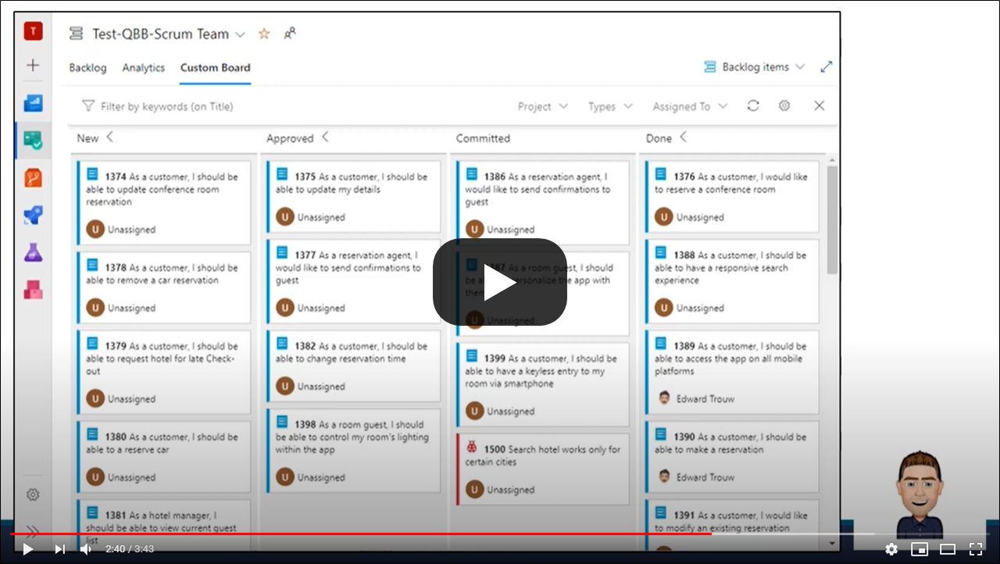

**Query Based Boards** enables a user to visualize the result of work item queries as a board and track the dependencies

> LICENSE: This is a free showcase project to show the possibilities of creating extensions for Azure DevOps Server/Services and the Formula Design System (ref: https://developer.microsoft.com/en-us/azure-devops/). It is provided by **Inetum-Realdolmen** 'as-is' under the general MIT license issued within the support page (on GitHub). So feel free to install it, try it out and use it in any of your organizations. But do this at your own risk, no guarantees and/or no warrentees of any kind are provided.

> NOTE: This is the second version of this extension. The first version was created by a former colleague of ours, all the credits for coming up with this idea is going to him! This version is however rebuild completely, based on the new Azure DevOps extension libraries and the new Formula Design System. The old and original project is still available on the marketplace (ref: https://marketplace.visualstudio.com/items?itemName=realdolmen.querybasedboards).

> IMPORTANT: Not all of the features that are available within the standard out of the box boards are implemented within this extension or in the exact same way. However this extension will provide several features that are not available (yet) within the standard.

## Introduction
If you are in need of more flexibility regarding the boards, or you want to build a custom flow and the standard boards won't fit to your needs.

This extension can be of great help to you! Just create a **flat** or **one-hop** query and show it as a board, it is as easy as that.

Here is a [link](https://youtu.be/tod0S2QXO-E) to an introduction video on YouTube with an overview of the available features, to get you started (or _click on the picture below_, it takes less than 4 minutes to watch):

> Please feel free to subscribe to the [YouTube channel](https://www.youtube.com/channel/UCPhOzbTeOeNiy3-sIgE0U5g) and watch other movies regarding the possibilities of this extension. When this version was released, only a few videos are available, but more will follow soon with detailed instructions regarding this extension. 

## Known limitations
* This extension is currently only available on Azure DevOps Services and Azure DevOps Server (demands the API version 5.0 at least; so it works on-line and on the on-premises versions 2019 and 2020);
* Be aware: this extension is created and supported for "on-line" first (like many other extensions). For "on-premises" instances there is limited support;
* Only 'flat' and 'one-hop' queries are implemented;
* When you use a 'one-hop' query, only the `Parent-Child` relations are suppported;
* The dependency arrows are based on `Successor-Predecessor` relations only;
* The columns are based on the values of the field `System.State` only;
* Only tested and validated on Chrome, FireFox and Edge (the new Chronium based version) for a regular non-touch device;
* Only tested and validated on Safari (IPhone) for a touch device;
* A couple of features are still in 'preview'.

(please review: https://github.com/edtro/EdTro.AzureDevOps.Extensions.querybasedboards/issues)

## Feedback
Please feel free to leave a behind your feedback within the Q & A section. We love to hear from you.

## Changelog

| Version | Description |
|---------|-------------| 
| 0.21262 | Fixed a bug regarding registrations within the manifest file. |
| 0.21066 | Applied a couple of minor changes to:   - the stylerules: you can now apply a stylerule based on a field, that is not displayed;   - the display fields with Type=2 (tags): added a 'tagColor' field to distinguish multiple fields (highly usefull when you are using the 'Multivalue control' extension);   - the filters: the Work Item Type filter displayed all of the types, instead of only the 'Child' types, so this is fixed;   - the filters: within the browser the last active filters are stored within the sessiondata, so it is not cleared when you browse to an other page/url;   - the filters: when selecting on '(empty)' with paths/tags the result was incorrect, this is adjusted;   - the filters: add the possibility to use nested custom filters. |
| 0.21059 | Solved a couple of minor rendering bugs and solved the bug that the 'doing' column was not displayed within the taskboard.   Also added a couple of new PREVIEW features:   - when you use the field 'System.Parent' within the 'advanced config/fields', the full styling is now implemented including clicktrough;   - this field will also be available within the quick filters;   - for the 'Taskboard' it makes no sense to filter on the already visible parent level itself, so it will allow you to filter on the grandparents (within the 'taskboard' this field will only be visible within that level);   - the first two config fields (of the type 'text' and when they are enabled with 'filter=true') are added to the quick filters, even the areapath/iterationpath and tags fields. **This will also enable you to filter on custom fields;**   - added an override 'type' field to the config display fields, so fields can be displayed as paths/tags (and filtered as such);   - very basic styling rules for the cards are implemented within the advanced configurations.    *Please note: these items are still in preview, so please report questions/bugs etc. to contribute on these features, but please do not expect immediate response and/or follow up.*| 
| 0.21044 | Resolved a bug for the import function (the configs where not imported when no document existed for a query)|
| 0.21020 | Added an import function for the advanced configurations while using a standard Microsoft REST api, see the new [imports.md](https://github.com/edtro/EdTro.AzureDevOps.Extensions.querybasedboards/blob/master/public/imports.md) document. |
| 0.21005 | Changed the way the 'Assigned To' icon is rendered (to reflect the standard). |
| 0.20362 | Solved a couple of minor rendering issues.   For the PREVIEW feature regarding configuring the colums: Added workitem counters and WIP limits to the columns, added the ability to adjust the column width, show multiple items next to each other, setting the column as collapsed as default and added **Parent Transition Mappings**.   For the PREVIEW feature regarding the quick filters, added for the taskboards the option to filter on if children exist and the option to filter on the parent state.   A big noticeable change is, is that the chevrons to collapse the columns are now displayed just like the standard boards (arranged to the right).    **VIDEO:** I have added a new video to my YouTube channel, regarding the 'Taskboard', but is also showing you a couple of the new features. Please check it out @ https://youtu.be/ag0LeNaR8Tc  |
| 0.20338 | Solved a bug regarding missing a field within the projectCollection. |
| 0.20326 | Added the filterbar, the ability to add extra fields to a work item card through the settings and the option to configure settings per query and globally.  Again added two **PREVIEW** features:  1. add extra fields to a work item card through the configuration  2. and the option to add tabs to the Backlog/Boards hub.  _Please note: these items are still in preview, so please report questions/bugs etc. to contribute on these features, but please do not expect immediate response and/or follow up._|
| 0.20308 | Solved a bug regarding cross-project relations/dependencies that they were not shown (not displayed as arrows). |
| 0.20305 | Solved a bug regarding the configured 'Backlog' columns (the collapse icon was still shown based on the StateCategory like the auto columns), did some rebranding and added some extra guidance when dragging an item (the columns, where it is allowed to drag the item to, are highlighted and the original position is marked).  Also added two **PREVIEW** features:  1. the option to use the 'As Of' date, that will allow you to browse back into time (for example: how many items where active yesterday?) 2. added the ability to configure swimlanes and split columns into doing/done (to use this, please take a look at the section regarding the configuration hub).     _Please note: these items are still in preview, so please report questions/bugs etc. to contribute on these features, but please do not expect immediate response and/or follow up._|
| 0.20140 | Solved a bug regarding the state categories. States within the category 'Resolved' where not taken into account, but this is resolved. So when you do not use the column configurations, make sure that the states you expect to show up as a column are setup as 'Proposed', 'InProgress', 'Resolved' or 'Completed'.|
| 0.20134 | Solved a bug regarding a loading error within the configuration hub when private queries where used.|
| 0.20122 | Enabled hovering cards within a collapsed column and refactored the div grid to use areas.|
| 0.20109 | Solved a minor bug regarding an invalid hex color code returned by the Rest API when using the 'old' xml process definitions.|
| 0.20104 | Added the Config hub, implemented configuration of the columns and also added the option to collapse the backlog columns.|
| 0.20096 | Solved some minor bugs, optimized the calculation of the arrow paths and implemented the support for touch devices.|
| 0.20065 | Improved the styling of the arrows and added zoom level slider.|
| 0.20064 | Solved minor bugs for on-prem.|
| 0.20062 | Initial version.|

If this project inspires you and/or you have specific requirements that are not not implemented within the standard and/or this project, please feel free to contact us, so we can see how we can help.

Created by **Inetum-Realdolmen**, please contact us at: https://www.realdolmen.com/en/solution/microsoft-application-lifecycle-management
 

 

