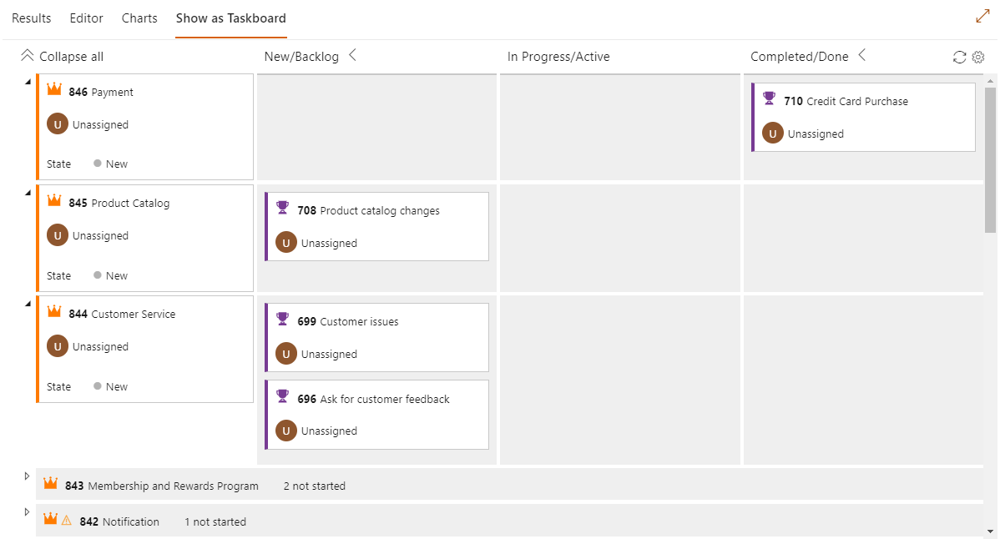

**Query Based Boards** enables a user to visualize the result of work items queries as a board

> LICENSE: This is a free showcase project to show the possibilities of creating extensions for Azure DevOps Server/Services and the Formula Design System (ref: https://developer.microsoft.com/en-us/azure-devops/). It is provided by Realdolmen 'as-is' under the general MIT license issued within the support page (on GitHub). So feel free to install it, try it out and use it in any of your organizations. But do this at your own risk, no guarantees and/or no warrentees of any kind are provided.

> NOTE: This the *second* version of this project and is completely recreated and based on the new Azure DevOps libraries and the Formula Design System. The old and original project is still available on the marketplace (ref: https://marketplace.visualstudio.com/items?itemName=realdolmen.querybasedboards) and was founded/created by a former colleague of ours. 

## What's special about 'Query Based Boards'? 
* The result of work item queries are visualized as a board ('flat' queries as a Kanban board and 'one-hop' queries as a Taskboard)
* Drag-n-drop work items to columns to adjust the specific State of the work item... this project is using the [React-Dnd](https://react-dnd.github.io/react-dnd/about) library
* Uses the REST Api to determin the columns dynamically of the work items that are within the result of the work item queries
* Can show the relations between 'successor' and 'predecessor' work items as arrows (only shows the relations of the work items already displayed on the board)

## How does it work?
Open up the 'flat' or 'one-hop' query and next to [Results] tab, a new tab called 'Show as Board' or 'Show as Taskboard' is displayed. Select this tab and the query will be shown as a board.

Options:
* the sorting is based on the result of the work item query
* when the query definition is changed, the changes have to be saved first, before these are reflected within the board
* the fields that are used within the cards are fetched automatically, they do not have to be included within the 'columns' section
* enable / disable the arrows within the settings
* click on the title of the work item to open and do possible modifications, these are directly reflected within the board

An image of the taskboard:

 

With relations:

 

The settings pane:

 

## Known limitations
* This extension is currently only available on Azure DevOps Services and Azure DevOps Server (demands the API version 5.0)
* Only 'flat' and 'one-hop' queries are implemented
* Only tested and validated on Chrome and Edge (IE does not work as of yet)
* Touch is not yet supported

## Feedback
Please feel free to leave a behind your feedback within the Q & A section. We love to hear from you. 

## Changelog
> 0.20062 initial version

Created by Realdolmen - a GFI company, please contact us at: https://www.realdolmen.com/en/solution/microsoft-application-lifecycle-management

If this project inspires you and/or you have specific requirements that are not not implemented within the standard and/or this project, please feel free to contact us, so we can see how we can help.
