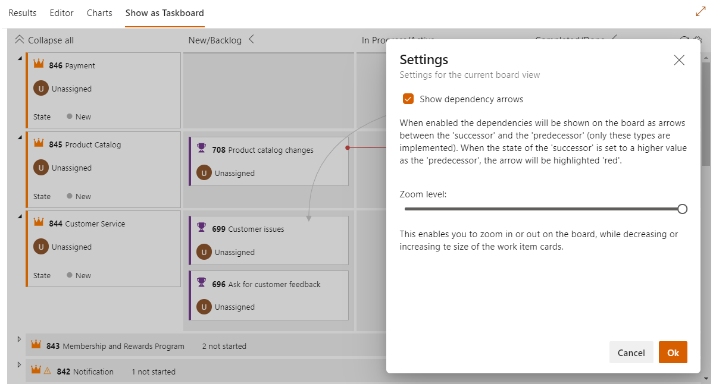

**Query Based Boards** enables a user to visualize the result of work item queries as a board and track the dependencies

> LICENSE: This is a free showcase project to show the possibilities of creating extensions for Azure DevOps Server/Services and the Formula Design System (ref: https://developer.microsoft.com/en-us/azure-devops/). It is provided by **Inetum-Realdolmen** 'as-is' under the general MIT license issued within the support page (on GitHub). So feel free to install it, try it out and use it in any of your organizations. But do this at your own risk, no guarantees and/or no warrentees of any kind are provided.

> NOTE: This is the second version of this extension. The first version was created by a former colleague of ours, all the credits for coming up with this idea is going to him! This version is however rebuild completely, based on the new Azure DevOps extension libraries and the new Formula Design System. The old and original project is still available on the marketplace (ref: https://marketplace.visualstudio.com/items?itemName=realdolmen.querybasedboards).

> IMPORTANT: Not all of the features that are available within the standard out of the box boards are implemented within this extension or in the exact same way. However this extension will provide several features that are not available (yet) wihtin the standard.

## What's special about 'Query Based Boards'? 
* The result of work item queries are visualized as a board ('flat' queries as a Kanban board and 'one-hop' queries as a Taskboard)
* Drag-n-drop work items to columns to adjust the specific state of the work item. This project is using the React-Dnd (ref: https://react-dnd.github.io/react-dnd/about) library with the Read-Dnd-Multi-Backend (ref: https://louisbrunner.github.io/dnd-multi-backend/packages/react-dnd-multi-backend/)
* Uses the REST Api to determin the columns dynamically of the work items that are within the result of the work item queries (these can also be setup within the configuration hub)
* Can show and track the dependencies/relations between 'successor' and 'predecessor' work items as arrows (only shows the relations of the work items already displayed on the board)
* Can zoom in and out to get a better overview of your work items
* Create boards for visualizing workitems for multiple projects, while using the "query accross projects" option

## How does it work?
Open up the 'flat' or 'one-hop' query and next to [Results] tab, a new tab called 'Show as Board' or 'Show as Taskboard' is displayed. Select this tab and the query will be shown as a board.

Options:
* the sorting is based on the result of the work item query
* when the query definition is changed, the changes have to be saved first, before these are reflected within the board
* the fields that are used within the cards are fetched automatically, they do not have to be included within the 'columns' section
* enable / disable the dependency arrows within the settings
* hover over an arrow to highlight the related work item cards
* zoom in / out while setting the zoom level within the settings
* click on the title of the work item to open and do possible modifications, these are directly reflected within the board
* use the configuration hub (within the Teamproject settings) to do some additional setup (ref: https://github.com/edtro/EdTro.AzureDevOps.Extensions.querybasedboards/blob/master/public/config.md)

An image of the taskboard:

 

With relations:

 

The settings pane:

 

An image of the kanban, using the high contrast dark theme and with relations:

 

Same kanban board, but now zoomed out:

 

An image of the configuration hub within the TeamProject settings:

 

## Known limitations
* This extension is currently only available on Azure DevOps Services and Azure DevOps Server (demands the API version 5.0 at least)
* Be aware: this extension is created and supported for "on-line" first (like many other extensions). For "on-premises" instances there is limited support.
* Only 'flat' and 'one-hop' queries are implemented
* Only tested and validated on Chrome, FireFox and Edge (the new Chronium based version) for a regular non-touch device
* Only tested and validated on Safari (IPhone) for a touch device

(please review: https://github.com/edtro/EdTro.AzureDevOps.Extensions.querybasedboards/issues)

## Feedback
Please feel free to leave a behind your feedback within the Q & A section. We love to hear from you. 

## Changelog

| Version | Description |
|---------|-------------|
| 0.20305 | Solved a bug regarding the configured 'Backlog' columns (the collapse icon was still shown based on the StateCategory like the auto columns), did some rebranding and added some extra guidance when dragging an item (the columns, where it is allowed to drag the item to, are highlighted and the original position is marked).  Also added two **PREVIEW** features:  1. the option to use the 'As Of' date, that will allow you to browse back into time (for example: how many items where active yesterday?) 2. added the ability to configure swimlanes and split columns into doing/done (to use this please look at section regarding the configuration hub).     _Please note: these items are still in preview, so please report questions/bugs etc. to contribute on these features, but please do not expect immediate response and/or follow up._|
| 0.20140 | Solved a bug regarding the state categories. States within the category 'Resolved' where not taken into account, but this is resolved. So when you do not use the column configurations, make sure that the states you expect to show up as a column are setup as 'Proposed', 'InProgress', 'Resolved' or 'Completed'.|
| 0.20134 | Solved a bug regarding a loading error within the configuration hub when private queries where used.|
| 0.20122 | Enabled hovering cards within a collapsed column and refactored the div grid to use areas.|
| 0.20109 | Solved a minor bug regarding an invalid hex color code returned by the Rest API when using the 'old' xml process definitions.|
| 0.20104 | Added the Config hub, implemented configuration of the columns and also added the option to collapse the backlog columns.|
| 0.20096 | Solved some minor bugs, optimized the calculation of the arrow paths and implemented the support for touch devices.|
| 0.20065 | Improved the styling of the arrows and added zoom level slider.|
| 0.20064 | Solved minor bugs for on-prem.|
| 0.20062 | Initial version.|

If this project inspires you and/or you have specific requirements that are not not implemented within the standard and/or this project, please feel free to contact us, so we can see how we can help.

Created by **Inetum-Realdolmen**, please contact us at: https://www.realdolmen.com/en/solution/microsoft-application-lifecycle-management
 

 

